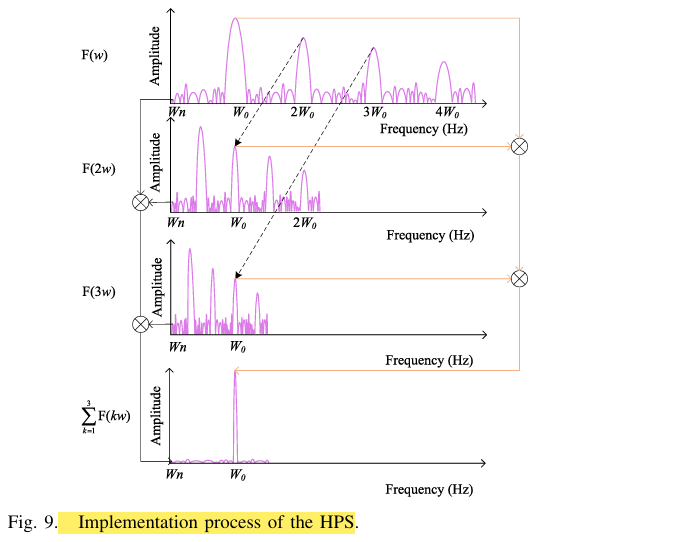
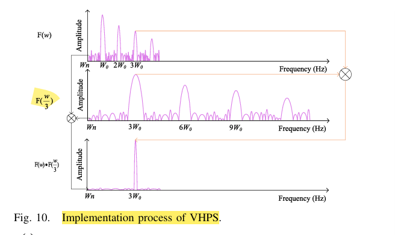

# 奇异谱分析+变分谐波乘积谱

基于奇异谱分析和变分谐波乘积谱的心率提取算法

## 信号分析

呼吸信号 谐波信号仿真

Range FFT  --> MTI --> heat filter(0.8-2hz)

TODO: 信处理整体流程图

在FMCW雷达探测的人体生命体征信号的过程中，信号主要由呼吸信号、心跳信号、环境静态杂波等构成，回波数据经过静态杂波滤除，提取出相位差分信号之后，呼吸信号由于其振幅远大于心跳信号，微弱的心跳基波信号会被呼吸信号的高次谐波淹没，因此呼吸信号的高次谐波会直接对心跳基波信号的提取存在显著影响。

为了解决呼吸信号的高次谐波对心跳信号的提取带来的干扰，本章中首先对类经验模态分解算法在提取心跳信号性能上进行验证，然后提出一个基于奇异谱分析和变分谐波乘积谱的算法，增强心跳信号的三次谐波，进而求解心率。

有表1可知，有医学经验知识，人体静息的心跳频率在0.8-2hz，也就是48~120BPM的心率，为了保留心跳及其高次谐波，设计一个通带范围为0.8-6hz的滤波器，使用该滤波器对差分信号进行滤波之后，使用奇异谱分析和变分谐波乘积谱算法进一步提取更为准确的心率。

## 奇异谱分析SSA

奇异谱分析(singular spectrum analysis，SSA)是一种处理非线性时间序列数据的方法，可以对时间序列进行分析和预测。它基于构造在时间序列上的特定矩阵的奇异值分解(singular value decomposition，SVD)，可以从一个时间序列中分解出趋势、振荡分量和噪声。SSA具有非常广泛的适用性，对于时间序列，既不需要假设参数模型，也不需要假设平稳性条件。

SSA的核心思想是将一个时间序列当作不同频率分量的叠加，通过分解，提取出贡献度较大的成分进行信号重构。SSA算法的主要步骤包括嵌入、分解、重构、归纳。SSA通过构造嵌入矩阵，进行奇异值分解，然后重构出本征模态函数和趋势项。

(序列嵌入--> 奇异值分解--> 矩阵分组--> 对角平均)

SSA算法流程：

对于输入时间序列$X = \{x_1,x_2,...x_N\}$  ，选择一个窗口长度$L$， 滑动窗口构造嵌入矩阵，将时间序列嵌入到一个$L\times k$的矩阵中，其中$K = N-L+1$ ，构造的嵌入矩阵如下所示：
$$
X = \left[ \begin{array}{cccc} x_1 & x_2 & \cdots & x_K \\ x_2 & x_3 & \cdots & x_{K+1} \\ \vdots & \vdots & \ddots & \vdots \\ x_L & x_{L+1} & \cdots & x_N \end{array} \right]
$$

构造完成嵌入矩阵后，对该矩阵进行奇异值分解，奇异值分解是一种矩阵分解方法，将任意矩阵分解为三个矩阵的乘积

$$
X = U \Sigma V^T
$$
U 是 $ L \times L$ 的正交矩阵，列向量为左奇异向量。
$\Sigma$ 是 $ L \times K$的对角矩阵，主对角线上的元素为奇异值，按照从大到小排列。
V 是 $K \times K$ 的正交矩阵，列向量为右奇异向量。

将上式改写为列向量乘行向量的形式，其中 r 是矩阵 X 的秩，也是非零奇异值的数量。
$$
X &=& \sum_{i = 1}^{r} \sigma_i u_i v_i^{T}  = \sum_{i=1}^{r}X_i \\
 &=& X_1 +X_2 + ...+X_r
$$
对轨迹矩阵完成奇异值分解之后，将非零奇异值进行分组，将其分解为n个线性无关的组合，记$\{ I_1,I_2,..I_n\}$

$$
X = \sum_{k =1}^{n} X_{I_k},X_{I_k} = \sum X_i , i \in I_k
$$
本文将每一个奇异值进行单独分组。

根据下式进行对角线均值化

$$
z_k = 
\begin{cases}
\frac{1}{k} \sum_{j=1}^{k} X_k(k-j+1, j), & 1 \leq k < L^* = \min(L, K) \\
\frac{1}{L^*} \sum_{j=1}^{L^*} X_k(k-j+1, j), & L^* \leq k \leq K^* = \max(L, K) \\
\frac{1}{N-k+1} \sum_{j=k-K^*+1}^{N-K^*+1} X_k(k-j+1, j), & K^* < k \leq N
\end{cases}
$$

对于分组$\{ I_1,I_2,..I_n\}$ ，每组的矩阵都进行反对角线均值化处理，对应都得到一个长度为 $N=L+K−1$ 的序列 $y_i,i=1,2,…,n$ ，将这 n 个向量相加就得到原时间序列的重构值。

本文选取前面6个最主要的成分进重构原始序列。

## 

### 反向差分

反向差分增强谐波信号。

心跳信号可以表示为如下的基波和高次谐波之后。对该信号进行反向差分处理增强心跳信号的高次谐波。
$$
x(t) = \sum_{i=1}^{N_h} a_{hi} \cos(2 \pi i f_h t + \theta_{hi})
$$
反向差分的计算过程如下：

$$
\begin{align}

y_l(t) &= x(t + \tau) - x(t)\\

&= \sum_{i=1}^{N_h} a_{hi} \cos(2 \pi i f_h (t + \tau) + \theta_{hi})- \sum_{i=1}^{N_h} a_{hi} \cos(2 \pi i f_h t + \theta_{hi})\\

&= \sum_{i=1}^{N_h} \left( -2 \sin(\pi i f_h \tau) \right) a_{hi} \sin \left( 2 \pi i f_h t + \pi i f_h \tau + \theta_{hi} \right)

\end{align}
$$
根据反向差分后的信号$y_l(t)$ 在时域上的表达式，

很明显，在一阶向后差分处理之后，第 i 次谐波的时域信号受到幅度因子$\left | \left( -2 \sin(\pi i f_h \tau) \right)\right |$.显然，当 $i f_h \tau \in (l,l+1/2)$ 且$l$是非负整数时，该调幅因子会随着 i 值的增加而放大。这样将重构信号经过差分便可以放大高次谐波信号。

## VHPS

根据Fourier级数理论，周期信号的第k次谐波幅值满足$A_k \propto  \frac{1}{k^ \alpha}(\alpha>0)$，由于心跳信号的三次谐波相对较弱，仅使用一阶向后差分实现的增强是有限的。此外，由于反向差分也放大了高频噪声，因此对心跳信号的三次谐波频率的检测可能仍然受到噪声的影响。因此，在此基础上，有必要进一步增强心跳信号中的三次谐波，同时抑制因差异而放大的高频噪声。

本文采用谐波乘积谱（HPS）来实现差分信号中的心跳高次谐波的增强，如下式所示，其是一种利用信号的谐波来增强原始信号的中心频率的算法，从而实现对于输入信号的中心频率的提取。

该算法对输入信号的频谱F(w)进行M倍的下采样得到F(Wm)，然后将这些下采样得到的高次谐波谱和基波谱相乘，如下图所示，不在中心频率w_0附近的频谱幅度都会被削弱，以此从信号中提取出中心频率。
$$
H(w) = F(w) \times F(2w) \times \cdots \times F(Mw) = \prod_{k=1}^{M} F(kw)
$$

但是心跳信号在其基波频段附近有着能量更大的呼吸信号的高次谐波干扰，但是其在心跳信号的高次谐波频段干扰较弱，因此本文采用变分谐波成绩谱的方法，对输入信号进行上采样，增强高次谐波，进而解算出心跳信号的基波频率。

VHPS是一种谐波增强方法，通过将信号的频谱与其上采样版本的频谱相乘，突出信号的谐波成分。这种方法有助于分离谐波与噪声，从而提高谐波检测的精度。

VHPS的公式为：
$$
V(w) = F(w) \times F(\frac{w}{2}) \times \cdots \times F(\frac{w}{M}) = \prod_{k=1}^{M} F\left(\frac{w}{k}\right)
$$

算法实现过程如下图所示：

